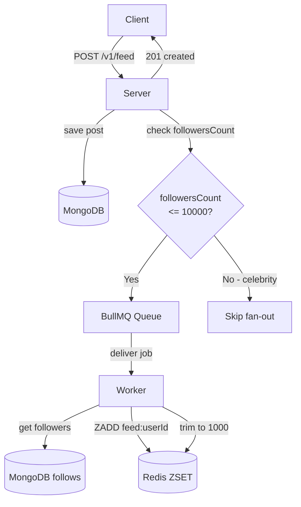
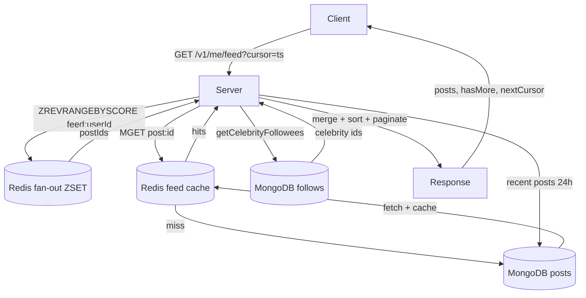
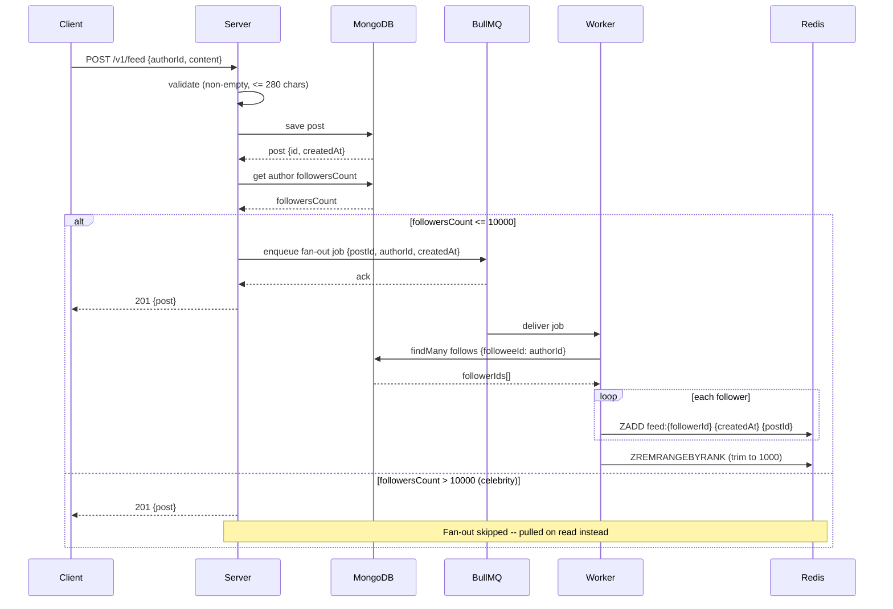
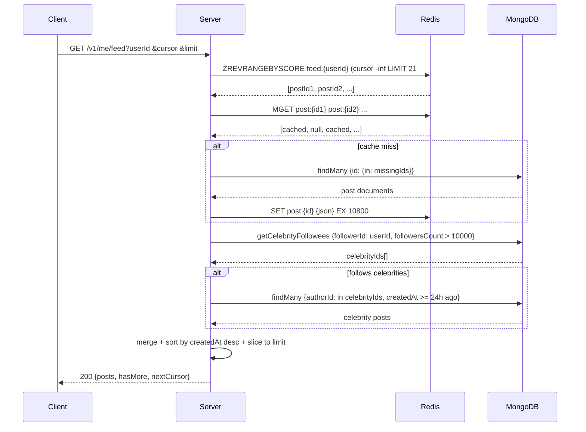

# Scalable News Feed System

A scalable news feed backend implementing the **fan-out-on-write** pattern with hybrid celebrity pull-on-read, built with Express, MongoDB, Redis, and BullMQ.

## Overview

This project implements a Twitter/X-style feed system with two paths:

- **Write path** -- `POST /v1/feed` creates a post, fans it out to followers' Redis feeds via a BullMQ worker
- **Read path** -- `GET /v1/me/feed` retrieves a user's feed with cursor-based pagination, hydrating posts via cache-aside (Redis -> MongoDB fallback)

### Hybrid feed model

| User type | Mechanism | Why |
| --- | --- | --- |
| Regular users (<10k followers) | Fan-out on write (push to Redis ZSET) | Fast reads, precomputed feed |
| Celebrities (>10k followers) | Pull on read (query MongoDB live) | Avoids millions of fan-out writes |

Both are merged into one paginated feed at read time.

## Architecture

### Write path (fan-out on write)



### Read path (cache-aside + celebrity pull)



> Detailed editable diagrams in `diagrams/` -- open any `.excalidraw` file at [excalidraw.com](https://excalidraw.com)

## Tech stack

- **Express 5** -- API server with OpenAPI/Swagger docs
- **MongoDB + Prisma** -- users, posts, follows collections
- **Redis (ioredis)** -- fan-out ZSET (per-user feed list) + feed cache (post content)
- **BullMQ** -- background job queue for fan-out worker
- **TypeScript** -- strict mode, CommonJS
- **Vitest** -- unit + integration tests
- **ESLint + Prettier + Husky** -- code quality and pre-commit hooks

## Getting started

### Prerequisites

- Node.js 20+
- MongoDB (Atlas or local)
- Redis (Upstash or local)

### Installation

```sh
git clone https://github.com/PrimeSlade/scalable-news-feed-system.git
cd scalable-news-feed-system
npm install
```

### Environment variables

Create a `.env` file in the root:

```env
DATABASE_URL="mongodb+srv://<user>:<pass>@<host>/<db>"
REDIS_URL="rediss://default:<password>@<host>:<port>"
PORT=3000
CELEBRITY_THRESHOLD=10000
FEED_CACHE_TTL_SECONDS=10800
NODE_ENV=development
```

| Variable | Description | Default |
| --- | --- | --- |
| `DATABASE_URL` | MongoDB connection string | Required |
| `REDIS_URL` | Redis connection string | `redis://localhost:6379` |
| `PORT` | Server port | `3000` |
| `CELEBRITY_THRESHOLD` | Follower count above which fan-out is skipped | `10000` |
| `FEED_CACHE_TTL_SECONDS` | TTL for cached post content in Redis | `10800` (3 hours) |
| `NODE_ENV` | `production` hides error details, `test` skips `app.listen()` | `development` |

### Run

```sh
npx prisma generate    # generate Prisma client
npm run seed           # (optional) seed test data
npm run dev            # start dev server with hot reload
```

Server runs at `http://localhost:3000`. Swagger docs at `http://localhost:3000/api`.

## API

### Create a post

```sh
curl -X POST http://localhost:3000/v1/feed \
  -H "Content-Type: application/json" \
  -d '{"authorId":"507f1f77bcf86cd799439002","content":"Hello world"}'
```

Response (`201`):
```json
{
  "status": "success",
  "data": {
    "id": "507f1f77bcf86cd799439012",
    "authorId": "507f1f77bcf86cd799439002",
    "content": "Hello world",
    "createdAt": "2024-01-01T00:00:00.000Z"
  }
}
```

### Read feed

```sh
# Page 1
curl "http://localhost:3000/v1/me/feed?userId=507f1f77bcf86cd799439001&limit=20"

# Page 2 (use nextCursor from page 1)
curl "http://localhost:3000/v1/me/feed?userId=507f1f77bcf86cd799439001&limit=20&cursor=1704110400000"
```

Response (`200`):
```json
{
  "status": "success",
  "data": {
    "posts": [
      { "id": "...", "authorId": "...", "content": "...", "createdAt": "..." }
    ]
  },
  "pagination": {
    "limit": 20,
    "hasMore": true,
    "nextCursor": "1704110400000"
  }
}
```

### Health check

```sh
curl http://localhost:3000/health
# { "status": "ok" }
```

## Commands

```sh
npm run dev           # start dev server (tsx watch)
npm run build         # compile TypeScript to dist/
npm start             # run compiled output
npm run lint          # ESLint on src/
npm run format        # Prettier write on src/
npm run format:check  # Prettier check on src/ (CI)
npm test              # vitest run (unit + integration)
npm run test:watch    # vitest in watch mode
npm run test:coverage # vitest with coverage report
npm run seed          # seed database with test data
```

**CI check order (run before pushing):**

```sh
npm run format:check && npm run lint && npx tsc --noEmit && npm test
```

## Project structure

```
src/
├── index.ts                  # Express entry point
├── lib/
│   ├── prisma.ts             # PrismaClient singleton
│   ├── redis.ts              # Redis singleton
│   └── queue.ts              # BullMQ queue + fan-out worker
├── middleware/
│   └── error-handler.ts      # AppError-aware error handler
├── modules/
│   └── feed/
│       ├── feed.types.ts     # CreatePostInput, PostResponse, GetFeedQuery, FeedResponse
│       ├── feed.repo.ts      # Prisma queries (createPost, getPostsByIds, getCelebrityFollowees, ...)
│       ├── feed.service.ts   # Business logic (createPost + fan-out, getFeed + cache-aside)
│       ├── feed.controller.ts# Request validation, calls service
│       ├── feed.routes.ts    # POST /v1/feed
│       └── me.feed.routes.ts # GET /v1/me/feed
└── utils/
    ├── errors.ts             # AppError hierarchy (404, 400, 401, 409)
    └── response.ts           # success/created/paginated helpers
```

## How it works

### Write path (fan-out on write)



### Read path (cache-aside + celebrity pull)



## Diagrams

Reference `diagrams/` for visual documentation:

```
diagrams/
├── architecture/
│   ├── ReadPath.excalidraw       # Read path component diagram
│   └── WritePath.excalidraw      # Write path fan-out architecture
└── sequence/
    ├── ReadPathSeqDiagram.excalidraw   # Read path UML sequence
    └── WritePathSeqDiagram.excalidraw  # Write path UML sequence
```

Open any `.excalidraw` file at [excalidraw.com](https://excalidraw.com).

## License

ISC
