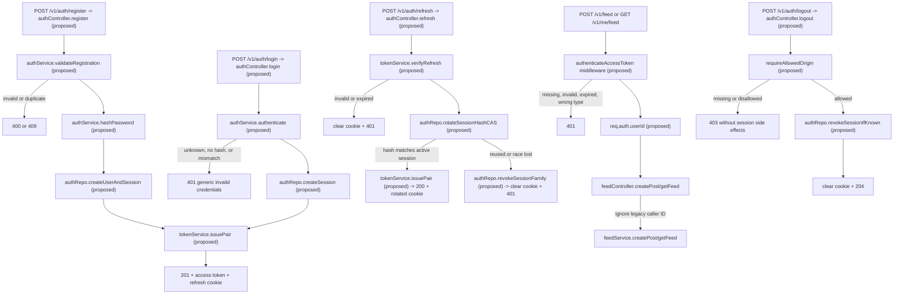

# Proposal: Implement User Authentication

Proposal approval: APPROVED
Approved by: user
Approved on: 2026-07-22

## Problem and outcome

`POST /v1/feed` trusts `authorId` from the request body and `GET /v1/me/feed` trusts `userId` from the query string. Any caller can therefore impersonate another user. Add local username/password authentication so protected operations derive identity only from verified access tokens, while preserving legacy inputs for one transition release without trusting them.

## Scope

- Add local registration, login, refresh, logout, and current-user profile APIs.
- Add bcrypt credentials, normalized usernames, and durable refresh-session state to MongoDB.
- Add bearer-token authentication middleware and protect post creation and personal-feed reads.
- Issue 15-minute access JWTs in JSON and rotate 7-day refresh JWTs in a browser cookie.
- Backfill normalized usernames before enforcing uniqueness and abort on case-fold collisions.
- Update OpenAPI, README examples, environment documentation, seed behavior, and existing feed specifications.

## Non-goals

- Email identity, verification, password recovery/change, account deletion, roles, permissions, logout-all, or external identity providers.
- Rate limiting, account lockout, auth-specific audit logs, or immediate access-token revocation.
- Cross-site cookie support or generic-client refresh-token delivery.
- Removal of legacy `authorId` and `userId` inputs in this release.

## Chosen design

- Extend `User` with nullable `passwordHash` and a unique normalized username key. Existing credential-less users remain readable but cannot log in. Services always project safe user fields explicitly.
- Add an auth-session model containing the user, current refresh-token hash, expiry, revocation state, and timestamps. Each login creates an independent session family.
- Hash passwords with configurable bcrypt cost. Registration requires `username`, `displayName`, and a password of at least 12 characters and at most 72 UTF-8 bytes.
- Sign access and refresh JWTs with separate HS256 secrets. Verify the expected algorithm, issuer, audience, token type, expiry, subject, and session identity.
- Return access tokens in success envelopes. Store refresh JWTs only in an HttpOnly, SameSite=Strict cookie scoped to `/v1/auth`; set Secure in production and require an allowed Origin for cookie-authenticated refresh/logout calls.
- Parse the refresh cookie with `cookie-parser`, registered before auth routes.
- Rotate refresh tokens with a compare-and-swap update of the stored token hash. Reuse of an old rotated token revokes that session family, clears the cookie, and returns a generic 401.
- Authentication middleware attaches verified identity to the Express request. Feed controllers ignore transitional caller IDs and use only that identity. Missing, expired, malformed, or wrong-type access tokens return a generic 401.
- Registration returns 201 with an access token and safe user, login returns 200 with the same, refresh returns 200 with a new access token, and `GET /v1/me` returns 200 with the safe user. After Origin validation, logout always clears the cookie and returns 204 regardless of session validity; invalid Origin returns 403 without session side effects.

## Function-level flow

## Tradeoffs

- Stateless access checks scale cleanly, but logout does not invalidate an already issued access token before its 15-minute expiry.
- MongoDB session records provide durable replay detection, but refresh and logout require database availability.
- Keeping password hashes on `User` avoids another relation, but requires explicit safe projections everywhere.
- Same-site cookies simplify CSRF controls, but prevent unrelated-site frontend deployments without a later protocol change.
- `cookie-parser` avoids custom parsing edge cases at the cost of one small runtime dependency.
- One-release compatibility reduces client disruption, but temporarily leaves ignored identity inputs in the API.

## Risks and rollout

- Run a normalized-username collision check before backfill or unique-index enforcement. Abort and report conflicts instead of renaming users.
- Preserve existing users with no password hash. They remain domain-visible and auth-ineligible until a future credential-provisioning flow exists.
- Validate access/refresh secrets, issuer, audience, bcrypt cost, token lifetimes, cookie mode, and allowed origins at startup; never use insecure production defaults.
- Mark legacy identity inputs deprecated in OpenAPI and remove them from examples. Remove the fields in the next release.
- The change is not production-ready without brute-force rate limiting. Auth-specific security event logging is also intentionally absent.
- Registration plus initial session creation requires atomic persistence; deployment MongoDB must support the selected transaction behavior.

## Acceptance criteria

- `AC-001`: A valid registration creates a normalized unique user with a bcrypt hash, creates a refresh session, sets the configured cookie, and returns 201 with an access token and no sensitive fields.
- `AC-002`: Duplicate normalized usernames return 409, invalid registration input returns 400, and no partial account/session remains after persistence failure.
- `AC-003`: Valid credentials return 200 with a new independent session; unknown users, legacy users without hashes, and wrong passwords return the same generic 401 response.
- `AC-004`: Access middleware accepts only valid access JWTs with all required claims and returns generic 401 for missing, expired, malformed, wrong-secret, or refresh tokens.
- `AC-005`: Protected post and feed requests use only the token subject; transitional `authorId` and `userId` values cannot change the acting user.
- `AC-006`: A valid refresh atomically rotates the stored hash and cookie and returns a new access token; the old refresh token cannot succeed again.
- `AC-007`: Reuse of a rotated refresh token revokes its session family, clears the cookie, and returns generic 401 without revoking unrelated sessions.
- `AC-008`: With an allowed Origin, logout returns 204 and clears the cookie whether the refresh token is active, missing, invalid, expired, or already revoked; an identifiable active session is revoked.
- `AC-009`: `GET /v1/me` returns only the authenticated user's safe profile; auth responses and logs never contain password hashes, refresh hashes, raw cookies, or refresh tokens in JSON.
- `AC-010`: Refresh and logout enforce the configured same-site Origin policy and production cookie flags; missing or disallowed Origin returns 403, and rejected logout performs no session mutation.
- `AC-011`: Startup fails clearly for missing or invalid auth configuration, and normalized-key rollout aborts with conflicting user IDs when legacy case-fold collisions exist.
- `AC-012`: OpenAPI, README, seed behavior, and feed specs describe bearer auth, transitional ignored identity fields, auth endpoints, configuration, and the next-release removal boundary.
